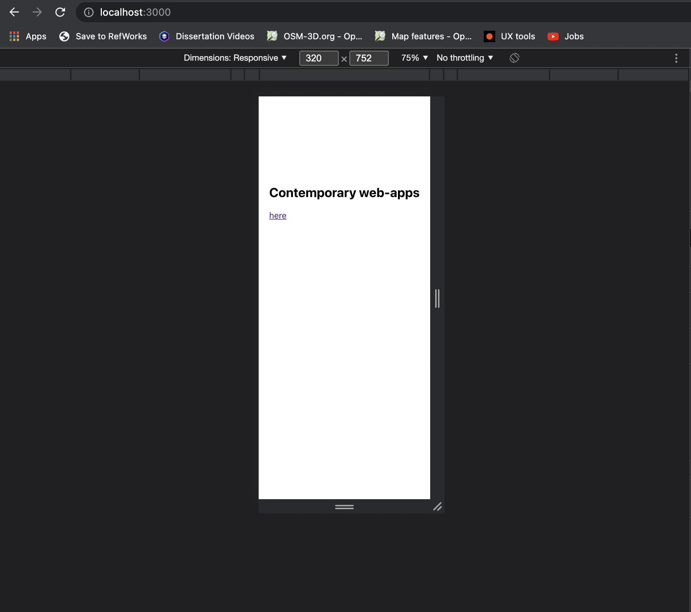
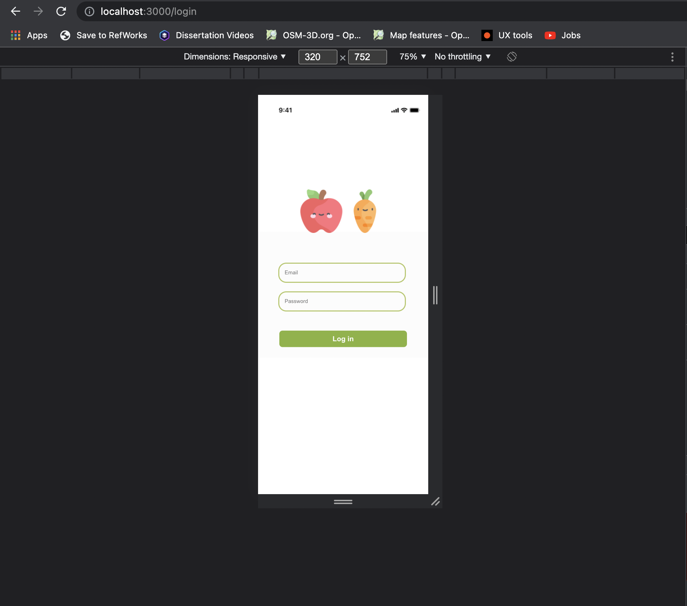
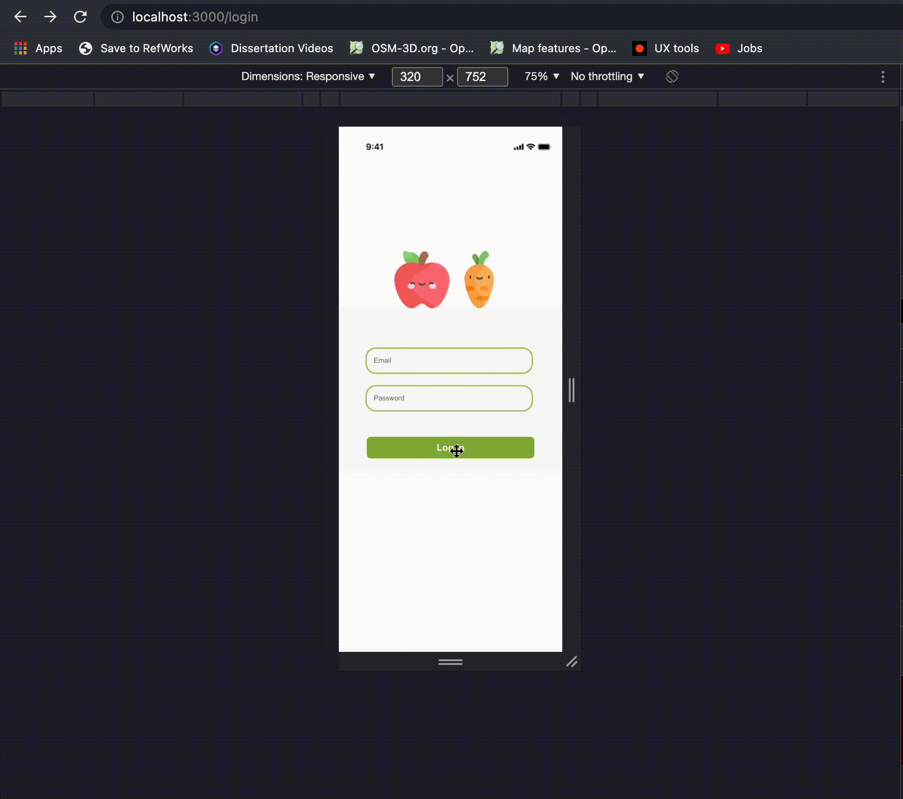
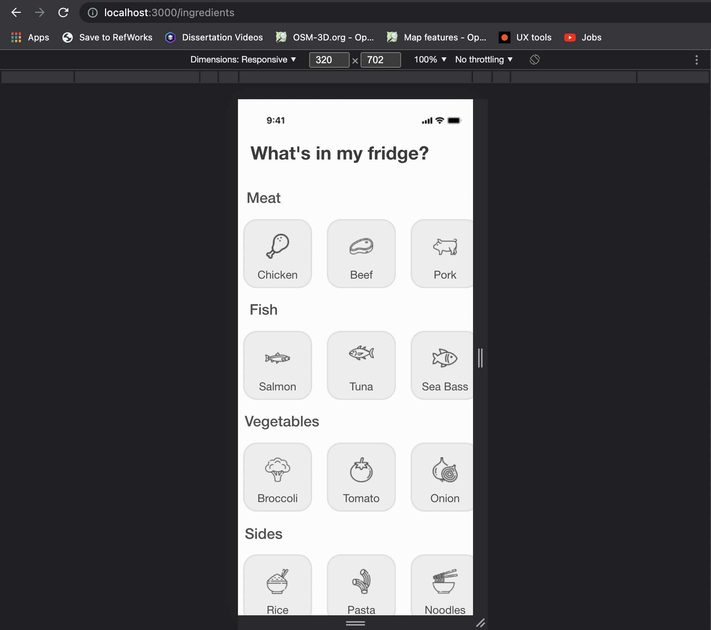
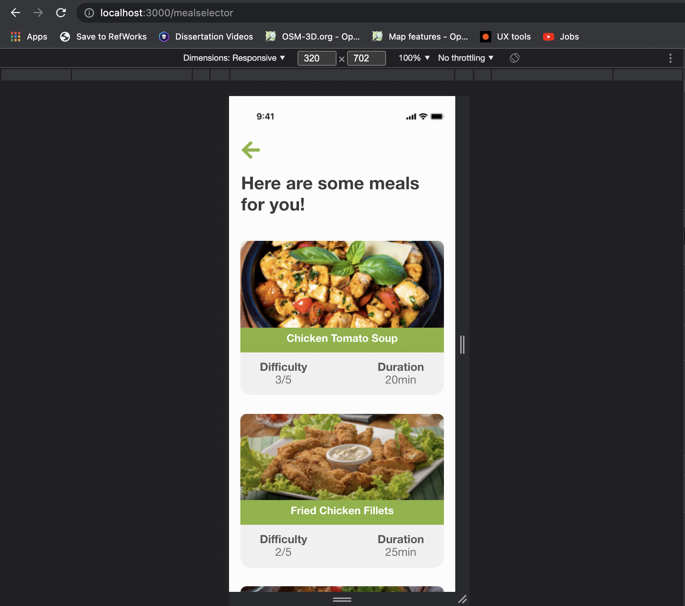
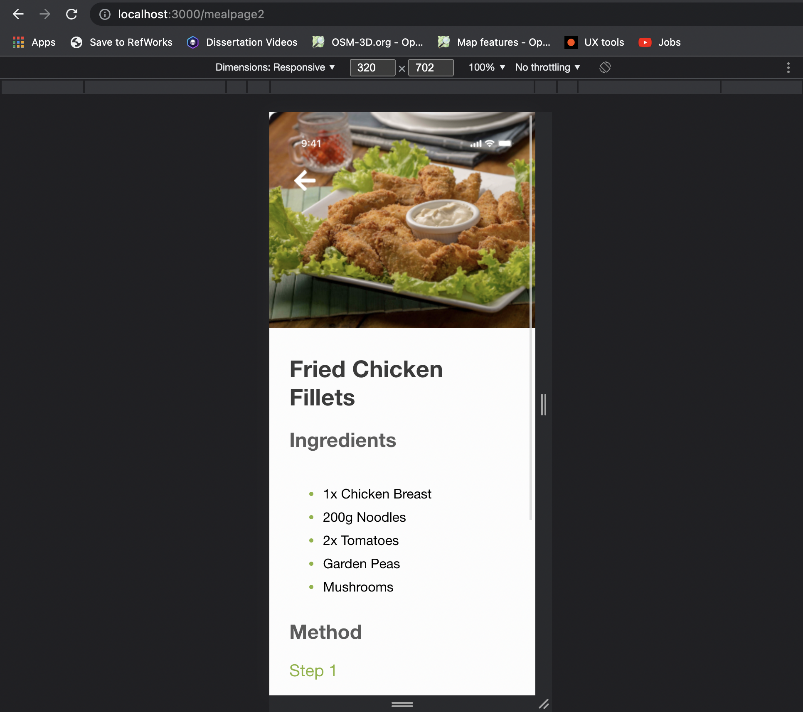

# What's in my fridge? - COM623

### Pedro de Almeida (Q14359421)

#### Hosted at: https://4dealp21.github.io/COM623-project/

#### Git Repository: https://github.com/4dealp21/COM623-project

---

## Introduction

This repository was developed to showcase a mobile react based web application that helps students of Solent University to mantain a helthy diet and save them some time and money.


​							**Figure 1**, The design thinking methodology, adapted from Interaction Design Foundation (n.d.).


This project follows the Design Thinking methodology as a lens (see Figure 1) and the part of the work done on this repository is represented by the Prototype and Test phases of the overarching DT methodology.


### **It is important to mention that in order to test the prototype, the browser window should be scaled down to 320px width**.

If for testing purposes the user has a window width matching a number above 320px, the code reaches a break point and tells the user to scale down the window as it can be seen in the example below.


The next steps of this report will document the methodology used to create this web app.

---

## Methodology

This section of the project relates to the part where the designs produced previously on Adobe XD, where now going to become alive with coding.


---

### Creating a workspace

#### Github and git version control

I wanted to have some sort of version control on the project, so before starting to code any line, there was the need to create a GitHub repository. After the repository was created on GitHub's website, I used:

### `git clone https://github.com/4dealp21/COM623-project.git`

This command line was responsible for cloning the repository on my computer where I could then work localy and send any modifications on the project to the repository in a matter of seconds. GitHub and git version control are incredible tools and it will be seen later on the project that having made this version control would help facing some issues in the future.


#### React

It's fairly easy to create the app itself, these where the command lines used to do so:

```bash
npx create-react-app 
cd my-app
npm start
```


After running this command lines, there is the need to populate ```App.js``` 

The follow command lines where written on the terminal window:

```bash
npm i react
npm i styled-components
npm i react-router-dom
```


An then these imports were used to populate ```App.js```:

```react
import React from "react";
import styled from "styled-components";
import { BrowserRouter as Router, Routes, Route, Link } from "react-router-dom";
```

**styled-components** - Styled-components arose from the need to improve CSS for styling React component systems. This resource is able to optimise  the experience for developers as well as the output for end users by focusing on a single use case.

**react-router-dom** - React Router DOM can be used to construct dynamic routing in a web project. Unlike traditional routing architecture, which handles routing in a configuration outside of a live app, React Router DOM enables component-based routing based on the demands of the app and platform.


The following code shows us the use of ```react-touter-dom``` on my react web app:

```react
const App = () => (
  <Router> 
    <Routes>
      <Route path="/myfridge" element={<MyFridge />} />
      <Route path="/login" element={<Login />} />
      <Route path="/ingredients" element={<Ingredients />} />
      <Route path="/mealselector" element={<MealSelector />} />
      <Route path="/mealpage1" element={<MealPage1 />} />
      <Route path="/mealpage2" element={<MealPage2 />} />
      <Route path="/mealpage3" element={<MealPage3 />} />
      <Route exact path="/" element={<Home />} />
    </Routes>
  </Router>
);

export default App;
```


The code for ```App.js``` at the time:

```react
import React from "react";
import styled from "styled-components";
import { BrowserRouter as Router, Routes, Route, Link } from "react-router-dom";
import MyFridge from "./Components/my-fridge/myfridge";

const StyledWrapper = styled.div`
    height: 50vh;
    display: flex;
    flex-direction: column;
    justify-content: center;
    align-items: center;
`;

const Home = () => (

  <StyledWrapper>
  <nav>
    <h1>Contemporary web-apps</h1>
        <Link to="/login">here </Link>
  </nav>
  </StyledWrapper>
);

const App = () => (
  <Router> 
    <Routes>
      <Route path="/myfridge" element={<MyFridge />} />
      <Route exact path="/" element={<Home />} />
    </Routes>
  </Router>
);

export default App;
```




---

### Components

The "Link" from ```react-router-dom``` was used on buttons to establish a connection between screens. Its usage on the code can be seen on the code block below:

```react
import {Link} from 'react-router-dom'

const Home = () => (

  <StyledWrapper>
  <nav>
    <h1>Contemporary web-apps</h1>
        <Link to="/login">here </Link>
  </nav>
  </StyledWrapper>
);
```

#### Login 

The login page is quite simple. Since I was designing the app on Adobe XD, I tried to make it look as simple, minimalist and clean as possible. There are few input boxes, text and images. Everything about the page is direct to the point, a simple login mechanism.

Sadly, the login was not implemented on the page, mainly due to poor time management. I tried to connect the App to a database hosted on firebase, turns out that was the most stressful part of this project once I couldn't make it the work and it somehow turned the other pages blank. Quite intriguing, I tried to solve this matter so I could continue with the login page but, which eventually led to no progress. The solution was to "go back in time" using git version control.

To do so, a branch was created in a previous commit and then merged with the master branch.

The login page can be seen on the screenshot below:



---

#### Welcome Screen

After hitting the Log in button on the Login Screen, the user will be redirected to the my ```fridge.js```, this page consists on a welcoming message where the fruit images from the login page start to move around and welcome the user. It's a simple but useful page, once it can convey a sense of happiness to the user on its return to the app.

The effect is made possible by ```@keyframes ``` and rotation animation. The code used can be seen below:

```react
import React, { useState } from "react";
import styled, { keyframes } from 'styled-components';
import apple from './assets/apple.png';
import carrot from './assets/carrot.png';

const AppleAnimation = keyframes`

    0% {
        transform: rotate(0deg);
    }
    50% {
        transform: rotate(-35deg);
    }
    100% {
        transform: rotate(0deg);
    }

`;

const CarrotAnimation = keyframes`

    0% {
        transform: rotate(0deg);
    }
    50% {
        transform: rotate(35deg);
    }
    100% {
        transform: rotate(0deg);
    }

`;

const Apple = styled.img`
@media (max-width: 320px) {
    margin-left: 60px; 
    position: relative;
    width: 82px;
    height: auto;
    animation: 2s ${AppleAnimation} ease-in-out infinite;
}
`;

const Carrot = styled.img`
@media (max-width: 320px) {
    margin-right: 60px; 
    position: relative;
    width: 82px;
    height: auto;
    animation: 2s ${CarrotAnimation} ease-in-out infinite;
}
`;
```

And the results can be seen in this next screencast:



---

#### Ingredients

In this screen a variety of meat, fish, sides and vegetables are shown to the user. It's prompt to the user to click on every button that relates to the ingredient that he has at home. The program then would based on the user's selections present an array of meals that are possible to be cooked.

This page has a few errors. Although I worked hard to make this page to operate, once this screen is considered the main core of the programme, the effort was insufficient, and the app does not meet the expected and cannot accomplish its main duty due to poor time management and lack expertise on the issue.

There are several small issues, such as horizontal scrolling that does not scroll far enough to the left, causing the final item to show partially on the screen. The other problem is seen when the user attempts to click the item button. The button's border was meant to become green, but it doesn't. I was almost there, but the only step I could make at this point was to have it change appearance when active, which meant that if the user clicked and then moved the cursor, the button's appearance would return to normal.

The following is a screenshot of the programme at this stage:



---

#### Meal Selector

This screen is where the user is chooses one meal between the variety of meals that the app proposes to him based on the previous inputs on the ingredients page.

This page was simple and fun to create. Each meal has its own image, name, and details, such as the duration that takes to make the dish and its difficulty in a scale of 0 to 5.

In this page, a new feature can be seen on the arrow on the top right corner of the screen. It's quite easy, the arrow consists on a Link to the ingredients page that can be used if the user forgets about any ingredient, or for some reason wants to revisit the previous page.

Not much to say there, each meal has its seperate page, as it will be seen on the next point.

Results can be seen here:



---

#### Meal Screen

These pages consist on the recipe of each meal. The page has the same feature than before that can send users to the previous page, it too has the the image of the meal on the top of the page, than the ingredients needed to cook the dish with the respective quantity and the steps to make the dish. 

Due to lack of time to make an individual page, lorem ipsum was utilised as a placeholder to represent possible text areas that would later be replaced with appropriate text.




---

## Conclusion

As is common in most academic projects, a lack of time management can have a significant impact on the ultimate product's delivery. This project was no exception. A time management issue led the creation of a basic prototype.

If I had more time to complete the project or if I had spent my time more wisely, I would have concentrated more on the mechanisms underlying the pages rather than the appearance of the displays. The attention would then shift to small flaws that may jeopardise the application's functionality, such as a button that didn't alter its look when pressed and better customising the meal pages so that each page could be unique. another thing that should have been developed better is the landing page, and as the app only works for mobile, once the user opened the browser, there should be a message telling the user to scale down the page so the content can be properly seen.

Even though, there were quite a lot of problems in the development of this app, I think that this assessment was fun to do and wish that could have managed my time better. Definitely had a lot of fun while doing the task and learned a lot of new react features.

