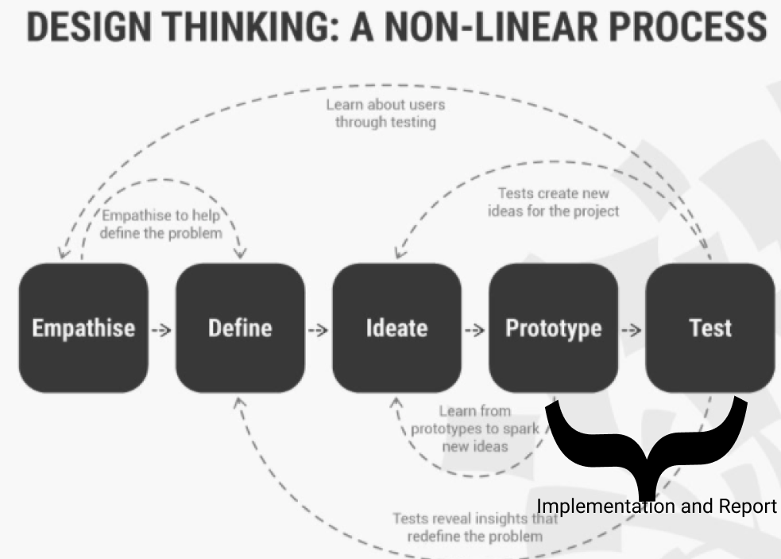

# What's in my fridge? - COM623

### Pedro de Almeida (Q14359421)

#### Hosted at: https://4dealp21.github.io/COM623-project/

#### Git Repository: https://github.com/4dealp21/COM623-project

---

## Introduction

This repository was developed to showcase a mobile react based web application that helps students of Solent University to mantain a helthy diet and save them some time and money.




​							**Figure 1**, The design thinking methodology, adapted from Interaction Design Foundation (n.d.).


This project follows the Design Thinking methodology as a lens (see Figure 1) and the part of the work done on this repository is represented by the Prototype and Test phases of the overarching DT methodology.


### **It is important to mention that in order to test the prototype, the browser window should be scaled down to 320px width**.

If for testing purposes the user has a window width matching a number above 320px, the code reaches a break point and tells the user to scale down the window as it can be seen in the example below.


The next steps of this report will document the methodology used to create this web app.

---

## Methodology

This section of the project relates to the part where the designs produced previously on Adobe XD, where now going to become alive with coding.


---

### Creating a workspace

#### Github and git version control

I wanted to have some sort of version control on the project, so before starting to code any line, there was the need to create a GitHub repository. After the repository was created on GitHub's website, I used:

### `git clone https://github.com/4dealp21/COM623-project.git`

This command line was responsible for cloning the repository on my computer where I could then work localy and send any modifications on the project to the repository in a matter of seconds. GitHub and git version control are incredible tools and it will be seen later on the project that having made this version control would help facing some issues in the future.


#### React

It's fairly easy to create the app itself, these where the command lines used to do so:

```bash
npx create-react-app 
cd my-app
npm start
```


After running this command lines, there is the need to populate ```App.js``` 

The follow command lines where written on the terminal window:

```bash
npm i react
npm i styled-components
npm i react-router-dom
```


An then these imports were used to populate ```App.js```:

```react
import React from "react";
import styled from "styled-components";
import { BrowserRouter as Router, Routes, Route, Link } from "react-router-dom";
```

**styled-components** - Styled-components arose from the need to improve CSS for styling React component systems. This resource is able to optimise  the experience for developers as well as the output for end users by focusing on a single use case.

**react-router-dom** - React Router DOM can be used to construct dynamic routing in a web project. Unlike traditional routing architecture, which handles routing in a configuration outside of a live app, React Router DOM enables component-based routing based on the demands of the app and platform.

---

## Conclusion

The modal was chosen as the last component of this project because, when utilised correctly and at the proper moment, it may be highly beneficial to the user and not an irritating additional hurdle between the user and his search.


This was by far the most challenging and time-consuming component of them all.


It is possible to conclude that, when used appropriately and in accordance with the standards (as was the case), the modal is a great addition to some websites, improving the user experience.